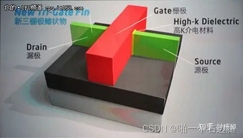

这里跟大家讨论CPU等设备中会存在频率、电压、功耗三者之间的关系究竟是怎么来的。

## 什么是OPP_table，设备的运行点

Operating Performance Points（OPP），SOC中允许一些域以较低的频率和电压运行，而其他的域运行在较高的电压和频率上。将域中每个设备支持的电压和频率的离散元组的集合称为Operating Performance Points。

其实OPP_table存在的核心意义还是为了功耗和性能之间的平衡，否则我们都把SOC直接拉到满频率跑就完事儿了，哪儿来这么多事情呢？我们在讲代码之前先来回顾一下之前的硬件知识

## 性能与功耗的平衡

CPU的性能和功耗之间的关系有一个经典的公式：


为什么是V^2乘以f，这要从CPU的架构开始说起，CPU的基本组成单元其实是若干个三极管。



三极管通过控制gate的电压实现源极和漏极之间的通断，最终形成二进制0和1的表示。想象成两个水系和闸门之间的关系吧，水系沟通和阻断是通过提起和放下闸门控制的。


提起和放下这个三极管上的闸门的功耗，就是CPU实现翻转的功耗，闸门本质上是一个电容。通断控制的过程其实本质上是电容的充放电过程。公式中的P其实就是电容充放电中的功耗了。C是电容的常数项系数。V是施加在电容上的电压。开关一次的功耗是C*V^2，注意这里的单位是J（焦耳），f是频率，频率是Hz，相当于每秒调整f次，每秒消耗的能量（单位W）即这么计算出了。

这里说明清楚一点，电压和频率往往是正相关的，电压给的越高，电容能够在更短的时间内完成充放电的过程，每秒内能够翻转的次数也就越多，这就可以给到更高的运行频率了。

## 动态频率和电压的调整

Power是与电压和频率相关的，内核中有个非常牛逼的方案——DVFS（Dynamic Voltage Frequency Scaling）。这个方案的存在在很大程度上衡量了性能与功耗的需求。简单来说，就是芯片可以动态调节自己的电压和频率，在性能需求低的时候用低的电压和频率去跑。性能需求高的时候用高的电压和频率去跑。


这里的方案其实已经非常完备了。有控制CPU频率的DVFS方案，有控制任务在各个核心上迁移，达到最优性能功耗表现的EAS（energy aware scheduling）方案。相关的power model、energy model等也在出厂时由各大芯片厂商已经预制在了芯片中。

perf_domain的注册

在[energy_model.c - kernel/power/energy_model.c - Linux source code (v5.15.105) - Bootlin](https://elixir.bootlin.com/linux/v5.15.105/source/kernel/power/energy_model.c)中可以找到这两个函数

```
em_register_per_domain()
    em_create_pd()
```

这里看起来是注册了perf domain，但是freq和power的来源只是一个轻飘飘的函数：

```cpp
		/*
		 * active_power() is a driver callback which ceils 'freq' to
		 * lowest performance state of 'dev' above 'freq' and updates
		 * 'power' and 'freq' accordingly.
		 */
        ret = cb->active_power(&power, &freq, cpu);
```

函数中只是从call back中获取了power和freq然后把他们赋给了em_perf_domain中的power和freq。

具体的函数我们还是要到cb中去寻找

我们来看看cb的结构体

```cpp
struct em_data_callback {
	/**
	 * active_power() - Provide power at the next performance state of
	 *		a device
	 * @power	: Active power at the performance state
	 *		(modified)
	 * @freq	: Frequency at the performance state in kHz
	 *		(modified)
	 * @dev		: Device for which we do this operation (can be a CPU)
	 *
	 * active_power() must find the lowest performance state of 'dev' above
	 * 'freq' and update 'power' and 'freq' to the matching active power
	 * and frequency.
	 *
	 * In case of CPUs, the power is the one of a single CPU in the domain,
	 * expressed in milli-Watts or an abstract scale. It is expected to
	 * fit in the [0, EM_MAX_POWER] range.
	 *
	 * Return 0 on success.
	 */
	int (*active_power)(unsigned long *power, unsigned long *freq,
			    struct device *dev);
};
#define EM_DATA_CB(_active_power_cb) { .active_power = &_active_power_cb }
```

注释里写了很多，其实只有一个active_power的函数指针，下面定义了一个宏，这个宏非常关键。

宏对应到of.c中我们才能看到真正power和freq的对应特点。

```cpp
dev_pm_opp_of_regster_em()
 
    _get_power()
 
       dev_pm_opp_find_freq_ceil()
 
       dev_pm_opp_get_voltage(opp)
 
       /* tmp = cap * mV * mV * Hz */
 
    em_dev_register_perf_domain()
```

这里看起来就很清楚了，callback中调用的是_get_power函数，这个函数中调用dev_pm_opp_find_freq_ceil来确认下一个频点在哪个位置，然后通过dev_pm_opp_get_voltage来确认opp对应的电压，最终通过power = n * V ^2 * f （还记得我们在上面讲的那个cpu功耗的物理公式吗？对！就是它）计算出最终的功耗值完成频率和功耗的对应关系，最终完成这个em_perf_domain的建立。

## OPP表

讲到这里其实我们只讲清楚了一个问题，em_perf_domain中的power和freq是通过OPP表来计算出来的，本质上讲我们还要讲清楚另一个问题，OPP表中的freq和voltage究竟是怎么来的呢？这个关系究竟是如何建立，系统又是如何得知的呢？我们继续往下深挖。

来看这两个函数

```cpp
/**
 * dev_pm_opp_get_voltage() - Gets the voltage corresponding to an opp
 * @opp:	opp for which voltage has to be returned for
 *
 * Return: voltage in micro volt corresponding to the opp, else
 * return 0
 *
 * This is useful only for devices with single power supply.
 */
unsigned long dev_pm_opp_get_voltage(struct dev_pm_opp *opp)
{
	if (IS_ERR_OR_NULL(opp)) {
		pr_err("%s: Invalid parameters\n", __func__);
		return 0;
	}
 
	return opp->supplies[0].u_volt;
}
EXPORT_SYMBOL_GPL(dev_pm_opp_get_voltage);
 
/**
 * dev_pm_opp_get_freq() - Gets the frequency corresponding to an available opp
 * @opp:	opp for which frequency has to be returned for
 *
 * Return: frequency in hertz corresponding to the opp, else
 * return 0
 */
unsigned long dev_pm_opp_get_freq(struct dev_pm_opp *opp)
{
	if (IS_ERR_OR_NULL(opp)) {
		pr_err("%s: Invalid parameters\n", __func__);
		return 0;
	}
 
	return opp->rate;
}
EXPORT_SYMBOL_GPL(dev_pm_opp_get_freq);
```

本质上都是从dev_pm_opp这个结构体中取rate和supplies域的值，只要找清楚dev_pm_opp这个结构体的初始化过程，就能搞清楚opp中频率和电压的对应关系了。

驱动中/drivers/base/power/opp/of.c这里的这个函数其实挺有意思

```cpp
/**
 * dev_pm_opp_of_add_table() - Initialize opp table from device tree
 * @dev:	device pointer used to lookup OPP table.
 *
 * Register the initial OPP table with the OPP library for given device.
 *
 * Return:
 * 0		On success OR
 *		Duplicate OPPs (both freq and volt are same) and opp->available
 * -EEXIST	Freq are same and volt are different OR
 *		Duplicate OPPs (both freq and volt are same) and !opp->available
 * -ENOMEM	Memory allocation failure
 * -ENODEV	when 'operating-points' property is not found or is invalid data
 *		in device node.
 * -ENODATA	when empty 'operating-points' property is found
 * -EINVAL	when invalid entries are found in opp-v2 table
 */
int dev_pm_opp_of_add_table(struct device *dev)
{
	struct device_node *opp_np;
	int ret;
 
	/*
	 * OPPs have two version of bindings now. The older one is deprecated,
	 * try for the new binding first.
	 */
	opp_np = dev_pm_opp_of_get_opp_desc_node(dev);
	if (!opp_np) {
		/*
		 * Try old-deprecated bindings for backward compatibility with
		 * older dtbs.
		 */
		return _of_add_opp_table_v1(dev);
	}
 
	ret = _of_add_opp_table_v2(dev, opp_np);
	of_node_put(opp_np);
 
	return ret;
}
EXPORT_SYMBOL_GPL(dev_pm_opp_of_add_table);
```

这里的v1和v2是在驱动中很常见的写法，主要是为了兼容表明不同代际的驱动。这里会尝试获取opp的数目，如果无法获取，则调用V1版本的函数去初始化opp_table，如果能获取到，那么调用V2版本的函数。

其实大同小异，我们就以V1为例来看看吧

```c
static int _of_add_opp_table_v1(struct device *dev)
{
	struct opp_table *opp_table;
	const struct property *prop;
	const __be32 *val;
	int nr, ret = 0;
 
	prop = of_find_property(dev->of_node, "operating-points", NULL);
	if (!prop)
		return -ENODEV;
	if (!prop->value)
		return -ENODATA;
 
	/*
	 * Each OPP is a set of tuples consisting of frequency and
	 * voltage like <freq-kHz vol-uV>.
	 */
	nr = prop->length / sizeof(u32);
	if (nr % 2) {
		dev_err(dev, "%s: Invalid OPP table\n", __func__);
		return -EINVAL;
	}
 
	opp_table = dev_pm_opp_get_opp_table(dev);
	if (!opp_table)
		return -ENOMEM;
 
	val = prop->value;
	while (nr) {
		unsigned long freq = be32_to_cpup(val++) * 1000;
		unsigned long volt = be32_to_cpup(val++);
 
		ret = _opp_add_v1(opp_table, dev, freq, volt, false);
		if (ret) {
			dev_err(dev, "%s: Failed to add OPP %ld (%d)\n",
				__func__, freq, ret);
			_dev_pm_opp_remove_table(opp_table, dev, false);
			break;
		}
		nr -= 2;
	}
 
	dev_pm_opp_put_opp_table(opp_table);
	return ret;
}
```

其实很简单，就是读取设备树，然后把设备树中的电压和频率映射关系建立起来的过程。

对应的设备树如下：

```c
cpu@0 { compatible = "arm,cortex-a9";
	reg = <0>;
	next-level-cache = <&L2>;
	operating-points = < 
                  /* kHz    uV */ 
                  792000  1100000 
                  396000  950000 
                  198000  850000 
           >; 
}; 
```

## 总结

其实opp_table以及em_perf_domain等都着眼于建立电压、频率、功耗三者之间的关系，电压和频率之间的关系是由硬件厂商在出厂时设备树中就已经定义好了的（至于为什么这么定义，我们改天再开一篇来讲讲？），电压和频率之间严格对应，电源域的电压直接对应了SOC运行的频率。而功耗和电压之间的关系是通过一个电容充放电的物理公式来建立了联系。